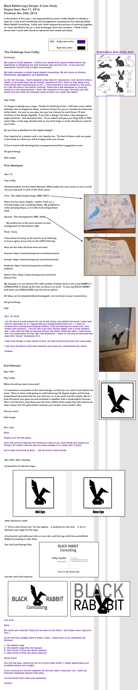

# _Black Rabbit Logo: A Case Study_

#### _{A logo design and case study narrative}, {Dec, 2017}_

#### By _**Kyle Lange**_

### See it live [HERE:](https://www.dropbox.com/s/podjuuqu8a7se3o/BR-case-study.png?dl=0)

## Description:

In November of this year, I was approached by owner Colby Hayden to design a logo for a new event marketing and management company he was starting called Black Rabbit Consulting.  Here is how it turned out:

## Setup/Installation Requirements

1. Download this repo using your terminal: git clone repo-name pasted here

2. View the code by drag-and-dropping the file into your [favorite text editor](https://atom.io)

3. run/check-out the program by dropping the index/html file from your folder into your web browser

## Support and contact details

For questions or comments, please __email  [Kyle here.](baronsintrees@gmail.com)__

## Technologies Used

* Markdown

### License

Copyright (c) 2016 **_Kyle Lange_**
